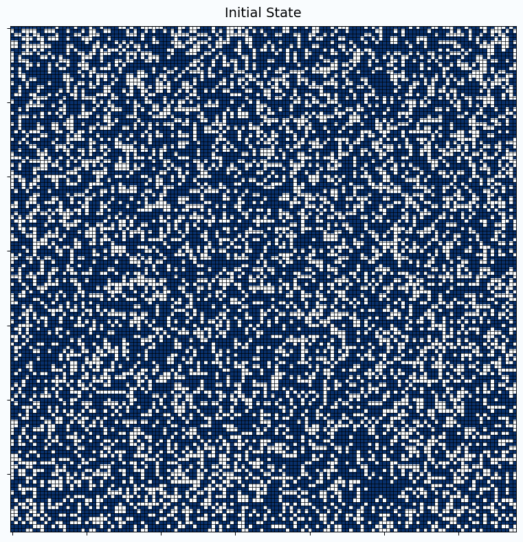

# AdventOfCode2025

My solutions for [Advent of Code 2025](https://adventofcode.com/2025).

## Approach

I generally strive to implement the solutions myself to sharpen my problem-solving skills. However, there are occasions when I leverage GitHub Copilot—partly due to time constraints, but also out of genuine curiosity about how well different AI models perform on algorithmic challenges. This hybrid approach allows me to learn both from crafting solutions independently and from observing AI-assisted problem-solving patterns.

## Progress

| Day | Part 1 | Part 2 | Solution |
|-----|--------|--------|----------|
| 1   | ⭐     | ⭐     | [Python](python/day01.py), [R](R/day01.R) |
| 2   | ⭐     | ⭐     | [Python](python/day02.py) |
| 3   | ⭐     | ⭐     | [Python](python/day03.py) |
| 4   | ⭐     | ⭐     | [Python](python/day04.py) |
| 5   | ⭐     | ⭐     | [Python](python/day05.py) |

## Day 4 Visualization

Day 4 involves iteratively removing paper rolls that forklifts can access. Here's a visualization of the process:



The animation shows how removing accessible rolls (blue squares) creates new opportunities for accessing previously inaccessible rolls, demonstrating a cascading effect similar to puzzle games.

## Running the Solutions

```bash
# Run Python solutions
cd python
python day01.py

# Run R solution (if Rscript is on your PATH)
Rscript ../R/day01.R

# On Windows, if Rscript is not on PATH you can use the absolute path, for example:
"C:/Software/R/R-4.3.1/bin/Rscript.exe" R/day01.R
```